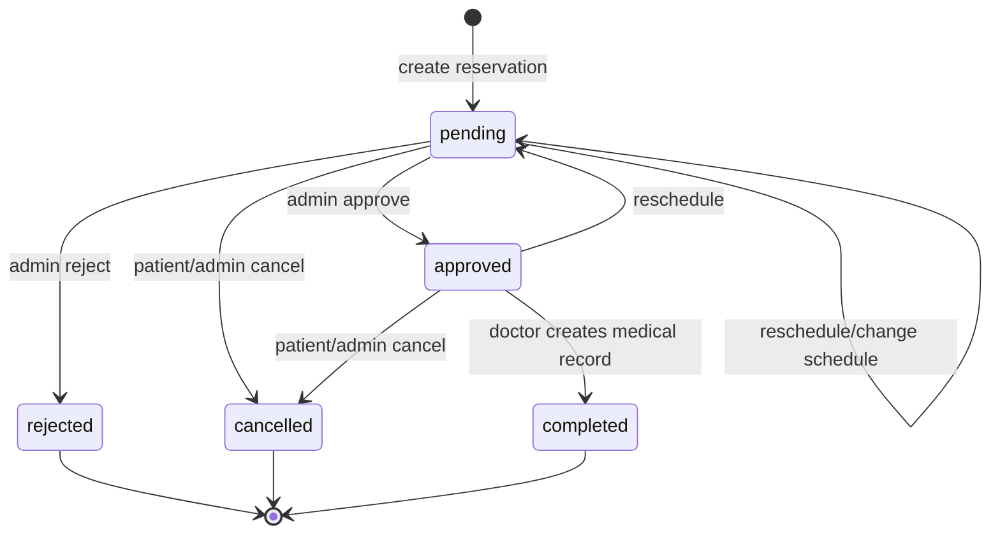
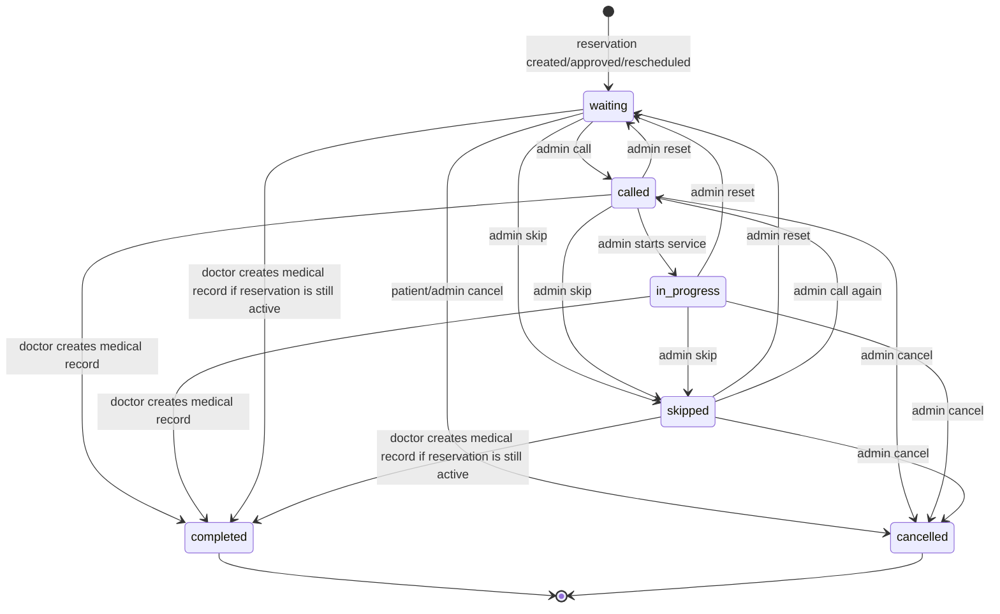

# Dokumentasi Status Reservasi dan Queue CliniQueue

Dokumen ini menjelaskan arti, transisi, aktor, dan dampak UI dari status `reservation.status` dan `reservation.queue_status` pada sistem CliniQueue. Tujuannya adalah agar tim frontend dapat memahami flow end-to-end mulai dari booking sampai reservasi selesai diproses dokter.

## 1. Konsep Utama

Sistem memiliki dua jenis status yang berbeda:

| Jenis status | Field | Menjawab pertanyaan | Contoh |
| --- | --- | --- | --- |
| Status reservasi | `status` | Apakah reservasi diterima, ditolak, dibatalkan, atau selesai? | `pending`, `approved`, `completed` |
| Status antrean | `queue_status` | Posisi pasien dalam proses antrean sedang apa? | `waiting`, `called`, `in_progress` |

Keduanya saling berhubungan, tetapi tidak sama.

Contoh:

```json
{
  "status": "approved",
  "queue_status": "waiting"
}
```

Artinya reservasi sudah disetujui admin, tetapi pasien masih menunggu dalam antrean.

## 2. Status Reservasi

Status reservasi tersimpan pada field:

```text
reservations.status
```

Daftar status:

```text
pending
approved
rejected
cancelled
completed
```

### 2.1 pending

`pending` adalah status awal reservasi.

Terjadi saat:

| Skenario | Aktor | Keterangan |
| --- | --- | --- |
| Pasien membuat reservasi | Patient | Reservasi masuk, menunggu approval admin |
| Admin membuat reservasi untuk pasien terdaftar | Admin/Superadmin | Digunakan untuk bantuan booking dari sisi klinik |
| Admin membuat reservasi walk-in | Admin/Superadmin | Pasien belum punya akun, memakai `guest_name` dan `guest_phone_number` |
| Pasien reschedule reservasi | Patient | Reservasi dikembalikan ke `pending` karena jadwal baru perlu diproses ulang |
| Admin mengubah data jadwal reservasi | Admin/Superadmin | Jika dokter/jadwal/tanggal berubah, reservasi kembali perlu diproses |

Makna untuk frontend:

- Tampilkan sebagai reservasi yang menunggu persetujuan.
- Admin perlu melihat tombol `Approve` dan `Reject`.
- Patient perlu melihat informasi bahwa reservasi belum final.
- Reservasi masih termasuk aktif.

### 2.2 approved

`approved` berarti reservasi telah diterima admin klinik.

Terjadi saat:

| Skenario | Aktor | Keterangan |
| --- | --- | --- |
| Admin approve reservasi pending | Admin/Superadmin | Reservasi menjadi valid dan boleh masuk antrean |

Makna untuk frontend:

- Tampilkan sebagai reservasi yang sudah terjadwal.
- Patient dapat melihat status antreannya.
- Admin dapat mengelola queue untuk reservasi tersebut.
- Doctor dapat melihatnya dalam queue sesuai jadwal klinik.
- Reservasi tetap `approved` selama antrean berjalan, sampai dokter membuat medical record.

Contoh kombinasi valid:

```json
{
  "status": "approved",
  "queue_status": "waiting"
}
```

```json
{
  "status": "approved",
  "queue_status": "called"
}
```

```json
{
  "status": "approved",
  "queue_status": "in_progress"
}
```

### 2.3 rejected

`rejected` berarti permintaan reservasi ditolak admin.

Terjadi saat:

| Skenario | Aktor | Keterangan |
| --- | --- | --- |
| Admin reject reservasi pending | Admin/Superadmin | Reservasi tidak diterima oleh klinik |

Makna untuk frontend:

- Tampilkan sebagai permintaan yang ditolak.
- Tidak boleh masuk antrean aktif.
- Tidak bisa diproses dokter.
- Tidak boleh diubah kembali menjadi status aktif.

Perbedaan utama dengan `cancelled`:

| Status | Arti |
| --- | --- |
| `rejected` | Klinik/admin tidak menerima permintaan reservasi |
| `cancelled` | Reservasi yang sudah ada dihentikan/dibatalkan |

Catatan teknis:

- Pada queue view, reservasi `rejected` dianggap tidak aktif.
- Sistem menormalkan antreannya seperti entry yang keluar dari antrean aktif.

### 2.4 cancelled

`cancelled` berarti reservasi dibatalkan setelah masuk sistem.

Terjadi saat:

| Skenario | Aktor | Keterangan |
| --- | --- | --- |
| Pasien membatalkan reservasi | Patient | Pasien tidak jadi datang |
| Admin membatalkan reservasi | Admin/Superadmin | Klinik membatalkan reservasi |
| Admin membatalkan dari queue management | Admin/Superadmin | Queue status diubah menjadi `cancelled` dan reservation status ikut `cancelled` |

Makna untuk frontend:

- Tampilkan sebagai reservasi yang dibatalkan.
- Tampilkan `cancellation_reason` jika ada.
- Jangan tampilkan di antrean aktif kecuali user memilih include history.
- Tidak bisa dikembalikan ke status aktif.

Catatan teknis:

- Saat menjadi `cancelled`, queue status juga menjadi `cancelled`.
- `queue_number` akan dikosongkan.
- Queue line akan dirapikan ulang agar nomor antrean aktif tetap berurutan.

### 2.5 completed

`completed` berarti reservasi sudah selesai diproses dokter.

Terjadi saat:

| Skenario | Aktor | Keterangan |
| --- | --- | --- |
| Dokter membuat medical record | Doctor | Pembuatan rekam medis menjadi aksi final penyelesaian reservasi |

Makna untuk frontend:

- Tampilkan sebagai reservasi selesai.
- Tampilkan link/detail rekam medis jika user punya akses.
- Tidak boleh dimunculkan sebagai antrean aktif.
- Admin tidak boleh langsung mengubah reservasi menjadi `completed`.

Catatan penting:

- `completed` hanya boleh terjadi melalui pembuatan medical record oleh dokter.
- Setelah completed, `queue_status` juga menjadi `completed`.
- `queue_number` dikosongkan dan antrean aktif dirapikan ulang.

## 3. Diagram Flow Status Reservasi



Terminal status:

```text
rejected
cancelled
completed
```

Terminal berarti status tidak boleh dikembalikan ke status aktif.

Active reservation status:

```text
pending
approved
```

Active berarti masih dapat diproses dalam flow reservasi atau antrean.

## 4. Status Queue

Status queue tersimpan pada field:

```text
reservations.queue_status
```

Daftar status:

```text
waiting
called
in_progress
skipped
completed
cancelled
```

### 4.1 waiting

`waiting` berarti pasien masih menunggu giliran.

Terjadi saat:

| Skenario | Aktor | Keterangan |
| --- | --- | --- |
| Reservasi dibuat | System | Default queue status |
| Reservasi direschedule | System | Queue status kembali waiting |
| Admin mengembalikan queue ke waiting | Admin/Superadmin | Misalnya salah call atau ingin reset status antrean |

Makna untuk frontend:

- Tampilkan nomor antrean.
- Tampilkan posisi antrean.
- Tampilkan `waiting_ahead`.
- Masih termasuk antrean aktif.

### 4.2 called

`called` berarti nomor antrean sedang dipanggil.

Terjadi saat:

| Skenario | Aktor | Keterangan |
| --- | --- | --- |
| Admin menekan call queue | Admin/Superadmin | Pasien dipanggil untuk masuk ke tahap layanan |

Makna untuk frontend:

- Highlight sebagai antrean yang sedang dipanggil.
- Untuk patient, tampilkan bahwa pasien harus bersiap atau menuju ruang layanan.
- Untuk admin/doctor, tampilkan sebagai current queue.

Catatan teknis:

- Dalam satu queue line, sistem menjaga agar hanya satu antrean berada pada status `called` atau `in_progress` secara aktif.
- Jika satu queue diubah menjadi `called`, queue lain yang sebelumnya `called` atau `in_progress` dapat dikembalikan ke `waiting`.

Notifikasi:

- Sistem mengirim notifikasi queue progress untuk status `called`.

### 4.3 in_progress

`in_progress` berarti pasien sedang dalam proses layanan/pemeriksaan.

Terjadi saat:

| Skenario | Aktor | Keterangan |
| --- | --- | --- |
| Admin mengubah queue ke in_progress | Admin/Superadmin | Menandai pasien sedang dilayani |

Makna untuk frontend:

- Tampilkan sebagai sedang diproses.
- Untuk doctor, ini bisa menjadi indikator pasien yang sedang diperiksa.
- Masih termasuk antrean aktif.

Catatan notifikasi:

- Sistem saat ini tidak mengirim notifikasi untuk `in_progress` agar tidak terlalu banyak notifikasi.

### 4.4 skipped

`skipped` berarti antrean pasien dilewati sementara.

Terjadi saat:

| Skenario | Aktor | Keterangan |
| --- | --- | --- |
| Admin menekan skip | Admin/Superadmin | Pasien belum hadir atau belum siap saat dipanggil |

Makna untuk frontend:

- Tampilkan sebagai dilewati.
- Masih termasuk antrean aktif.
- Admin masih dapat memanggil lagi atau mengubah statusnya.

Catatan notifikasi:

- Sistem saat ini tidak mengirim notifikasi untuk `skipped` agar tidak mengganggu pasien dengan terlalu banyak notifikasi.

### 4.5 completed

`completed` berarti antrean selesai.

Terjadi saat:

| Skenario | Aktor | Keterangan |
| --- | --- | --- |
| Dokter membuat medical record | Doctor | Queue selesai bersamaan dengan reservation completed |

Makna untuk frontend:

- Jangan tampilkan di antrean aktif.
- Tampilkan di history jika diperlukan.
- Tampilkan akses ke medical record sesuai role dan scope.

Catatan penting:

- Admin tidak boleh mengubah queue langsung menjadi `completed`.
- Completion hanya melalui dokter saat membuat medical record.

### 4.6 cancelled

`cancelled` berarti antrean dibatalkan dan keluar dari antrean aktif.

Terjadi saat:

| Skenario | Aktor | Keterangan |
| --- | --- | --- |
| Reservation cancelled | Patient/Admin/Superadmin | Queue ikut cancelled |
| Admin cancel dari queue management | Admin/Superadmin | Reservation status ikut cancelled |
| Reservation rejected | Admin/Superadmin | Di queue view dianggap tidak aktif seperti cancelled |

Makna untuk frontend:

- Jangan tampilkan di antrean aktif.
- Tampilkan di history jika user memilih include history.
- Jangan tampilkan tombol call/in_progress untuk terminal queue.

## 5. Diagram Flow Status Queue



Active queue status:

```text
waiting
called
in_progress
skipped
```

Terminal queue status:

```text
completed
cancelled
```

## 6. End-to-End Flow Utama

### 6.1 Pasien membuat reservasi sampai selesai

```text
Patient pilih clinic, doctor, date, window
-> submit reservation
-> reservation.status = pending
-> queue_status = waiting
-> admin approve
-> reservation.status = approved
-> queue_status = waiting
-> admin call queue
-> queue_status = called
-> admin set in_progress atau dokter mulai proses
-> queue_status = in_progress
-> dokter membuat medical record
-> reservation.status = completed
-> queue_status = completed
```

Frontend expectation:

- Patient reservation page menampilkan `pending` setelah booking.
- Setelah admin approve, patient queue page menampilkan nomor antrean dan posisi.
- Saat `called`, patient perlu melihat highlight bahwa antreannya dipanggil.
- Setelah `completed`, patient diarahkan untuk melihat medical record.

### 6.2 Admin menolak reservasi

```text
reservation.status = pending
-> admin reject
-> reservation.status = rejected
-> queue_status dianggap tidak aktif/cancelled
```

Frontend expectation:

- Tampilkan status `rejected` pada daftar reservasi.
- Jangan tampilkan di active queue.
- Tidak tampil tombol queue management aktif.

### 6.3 Pasien membatalkan reservasi

```text
reservation.status = pending/approved
-> patient cancel
-> reservation.status = cancelled
-> queue_status = cancelled
-> queue number dikosongkan
-> queue line dirapikan ulang
```

Frontend expectation:

- Patient melihat status `cancelled`.
- Jika ada `cancellation_reason`, tampilkan.
- Queue aktif pasien lain otomatis berubah posisi jika terdampak.

### 6.4 Admin membatalkan dari queue management

```text
reservation.status = approved
queue_status = waiting/called/in_progress/skipped
-> admin set queue_status = cancelled
-> reservation.status = cancelled
-> queue_status = cancelled
-> queue number dikosongkan
```

Frontend expectation:

- Di queue management, admin bisa cancel entry aktif.
- Setelah cancel, entry keluar dari active queue.
- Queue list perlu refresh agar posisi pasien lain terbaru.

### 6.5 Pasien melakukan reschedule

```text
reservation.status = pending/approved
-> patient reschedule date/schedule/window
-> reservation.status = pending
-> queue_status = waiting
-> queue number dihitung ulang
-> window slot dihitung ulang
```

Frontend expectation:

- Reschedule harus meminta `reschedule_reason` untuk patient.
- Setelah reschedule, reservasi kembali `pending`.
- Admin perlu approve ulang.
- Jika pindah schedule/date, queue lama dan queue baru sama-sama dirapikan.

### 6.6 Admin mengubah data reservasi

```text
admin edit patient/guest/doctor/schedule/date/window
-> jika jadwal berubah, queue dan window slot dihitung ulang
-> reservation dapat kembali pending jika perlu approval ulang
```

Frontend expectation:

- Gunakan form edit reservation untuk data administratif.
- Jika mengganti doctor, schedule yang dipilih harus milik doctor dan clinic yang sesuai.
- Jika mengganti date/window, frontend perlu reload available windows.

### 6.7 Dokter menyelesaikan reservasi

```text
reservation.status = approved atau pending aktif
queue_status = waiting/called/in_progress/skipped
-> doctor create medical record
-> reservation.status = completed
-> queue_status = completed
-> queue number dikosongkan
```

Frontend expectation:

- Doctor page menampilkan queue sesuai clinic dan schedule dokter.
- Tombol/aksi selesai sebaiknya berupa `Create Medical Record`, bukan `Complete Reservation`.
- Setelah medical record dibuat, tampilkan confirmation dan keluarkan pasien dari queue aktif.

## 7. Matrix Aksi Frontend

| Role | Page | Aksi | Status awal valid | Status akhir |
| --- | --- | --- | --- | --- |
| Patient | Reservation | Create booking | - | `pending` + `waiting` |
| Patient | Reservation | Reschedule | `pending`, `approved` | `pending` + `waiting` |
| Patient | Reservation | Cancel | `pending`, `approved` | `cancelled` + `cancelled` |
| Admin/Superadmin | Reservation | Approve | `pending` | `approved` |
| Admin/Superadmin | Reservation | Reject | `pending` | `rejected` |
| Admin/Superadmin | Reservation | Cancel | `pending`, `approved` | `cancelled` + `cancelled` |
| Admin/Superadmin | Queue | Call | active queue | `called` |
| Admin/Superadmin | Queue | Set waiting | active queue | `waiting` |
| Admin/Superadmin | Queue | Set in progress | active queue | `in_progress` |
| Admin/Superadmin | Queue | Skip | active queue | `skipped` |
| Admin/Superadmin | Queue | Cancel queue | active queue | `cancelled` + reservation `cancelled` |
| Admin/Superadmin | Queue | Reorder queue number | active queue only | queue number changes |
| Doctor | Medical Record | Create medical record | active reservation | `completed` + `completed` |

## 8. UI Rendering Rules

### 8.1 Reservation list

Recommended display:

| Status | Badge color suggestion | Primary action |
| --- | --- | --- |
| `pending` | Yellow/amber | Admin: approve/reject, Patient: wait/cancel/reschedule |
| `approved` | Green/blue | Patient: track queue, Admin: manage queue |
| `rejected` | Red/gray | View reason/notes only |
| `cancelled` | Gray/red | View cancellation reason only |
| `completed` | Green/gray | View medical record |

### 8.2 Queue list

Recommended display:

| Queue status | Badge color suggestion | UI behavior |
| --- | --- | --- |
| `waiting` | Gray/blue | Show queue number, position, waiting ahead |
| `called` | Strong green/blue | Highlight as currently called |
| `in_progress` | Purple/blue | Mark as being served |
| `skipped` | Amber | Keep visible in active queue |
| `completed` | Gray/green | Hide from active queue, show in history |
| `cancelled` | Gray/red | Hide from active queue, show in history |

### 8.3 Active queue filtering

Active queue should include only:

```text
waiting
called
in_progress
skipped
```

And reservation status should be active:

```text
pending
approved
```

History queue can include:

```text
completed
cancelled
```

## 9. Notification Summary

Current notification behavior relevant to status flow:

| Event | Notification |
| --- | --- |
| Reservation approved | Sent |
| Reservation rejected | Sent |
| Reservation rescheduled | Sent |
| Reservation cancelled | Sent |
| Queue called | Sent |
| Queue in_progress | Not sent |
| Queue skipped | Not sent |
| Queue reordered manually | Not sent |
| Queue position changes because another reservation completed | Not sent |
| Medical record created/reservation completed | Sent as medical record ready/completed notification |

## 10. Important Implementation Notes for Frontend

Use these fields from reservation payload:

```json
{
  "id": 1,
  "reservation_number": "RSV-20260427-123456",
  "reservation_date": "2026-04-27",
  "window_start_time": "09:00:00",
  "window_end_time": "09:30:00",
  "status": "approved",
  "queue_summary": {
    "number": 1,
    "status": "waiting",
    "position": 1,
    "waiting_ahead": 0,
    "size": 3,
    "current_called_number": null,
    "is_current": false
  }
}
```

Use these fields from queue payload:

```json
{
  "reservation_id": 1,
  "reservation_number": "RSV-20260427-123456",
  "reservation_date": "2026-04-27",
  "reservation_status": "approved",
  "window": {
    "start_time": "09:00:00",
    "end_time": "09:30:00",
    "slot_number": 1
  },
  "queue": {
    "number": 1,
    "status": "called",
    "position": 1,
    "waiting_ahead": 0,
    "size": 3,
    "current_called_number": 1,
    "is_current": true
  }
}
```

Frontend should avoid deriving reservation lifecycle only from `queue.status`. Use both:

```text
reservation.status for lifecycle
queue.status for queue progress
```

Example:

```text
If reservation.status = completed, show completed even if queue data is hidden from active queue.
If queue.status = called, highlight queue progress but reservation.status usually remains approved.
```
